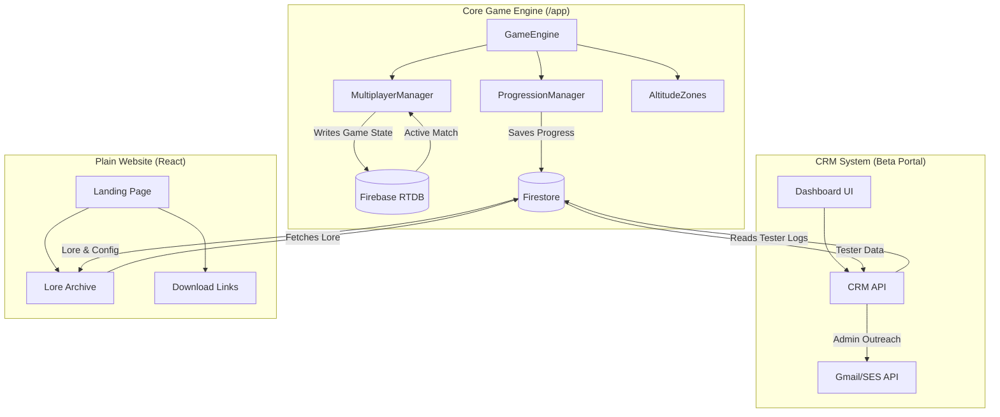

# Jump Droid Project Map

A high-level overview of the three primary domains in the Jump Droid ecosystem and their inter-relationships.

## Domain Responsibilities

### [Game] Core Engine
- **Platform:** Android (Kotlin/Compose)
- **Role:** High-intensity gameplay, physics, and real-time multiplayer logic.
- **Data Flow:** Primary producer of session analytics and leaderboard scores.

### [Website] Public Landing
- **Platform:** Web (React/Next.js)
- **Role:** Marketing, lore documentation, and public-facing distribution hub.
- **Data Flow:** Consumer of game-exported lore entries and status config.

### [CRM] Beta Portal
- **Platform:** Web (Isolated React/Next.js sub-app)
- **Role:** Recruitment orchestration, tester performance auditing, and campaign management.
- **Data Flow:** Heavy reader of Firestore `testers` and `sessions` collections; orchestrates invitation emails.
