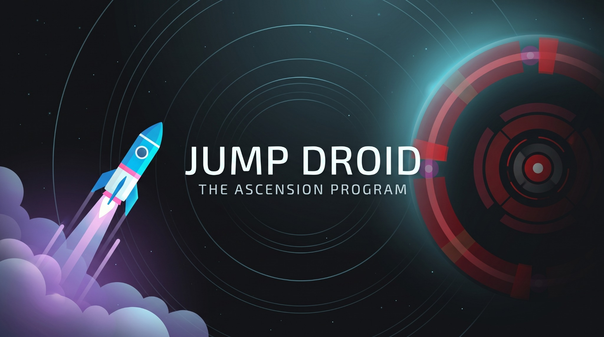
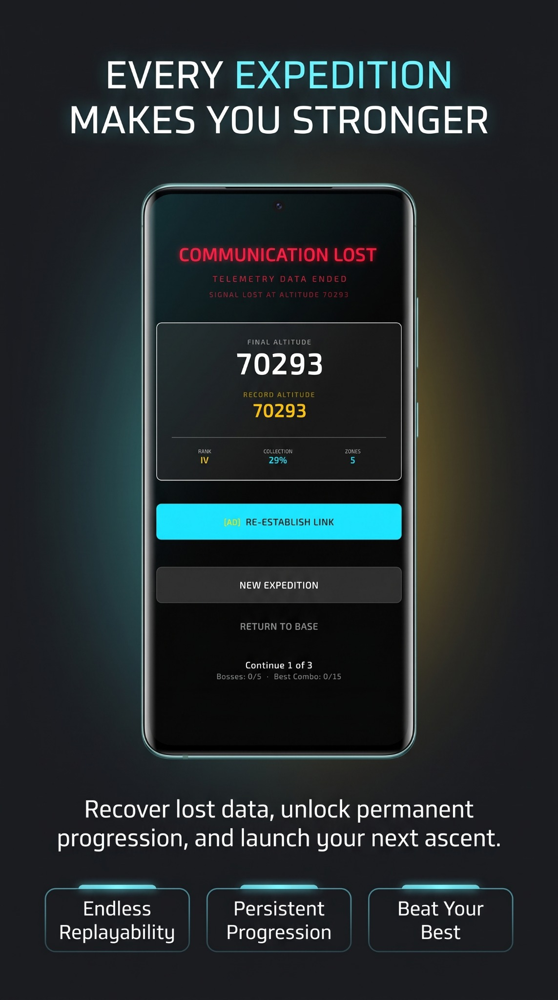
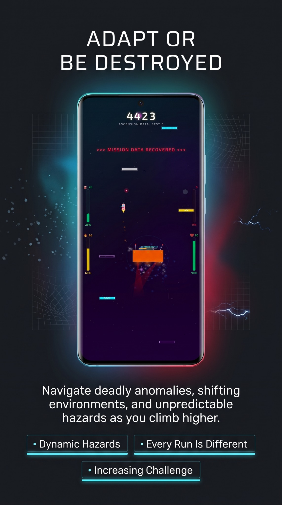
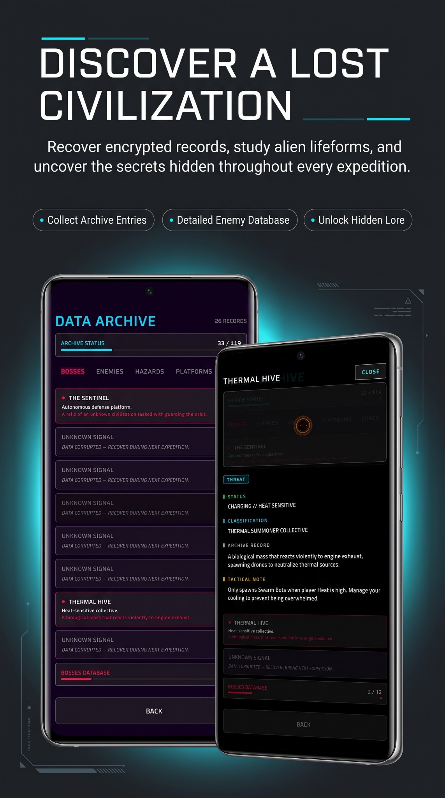
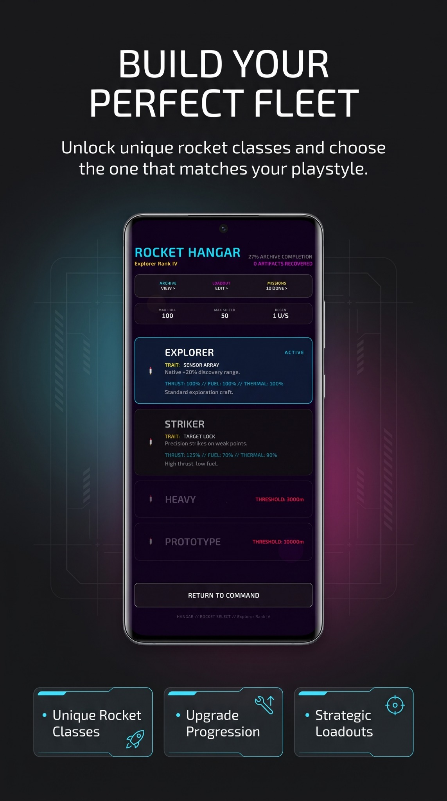
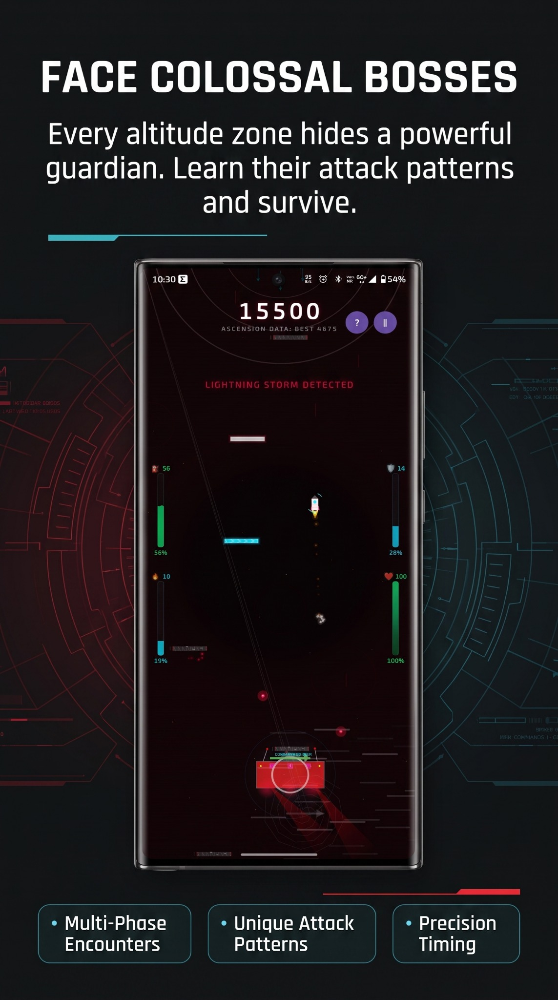
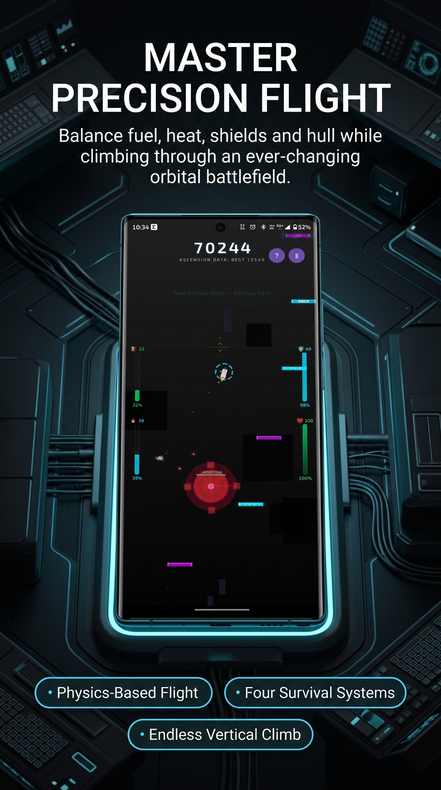
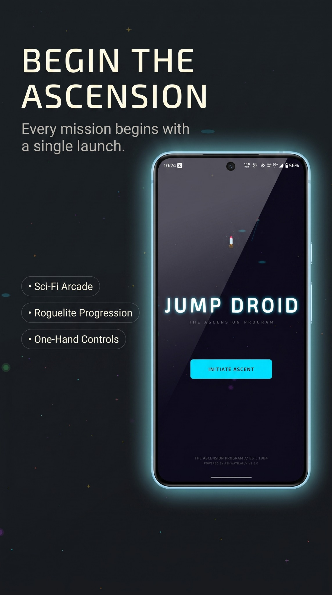
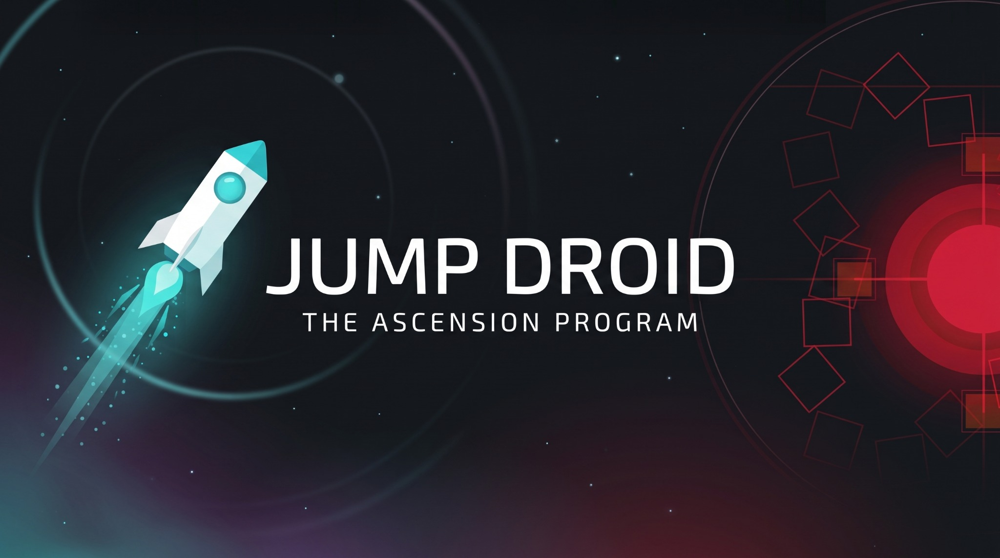

<p align="center">
  
</p>

<p align="center">
  <b>A vertical rocket exploration game built with Kotlin and Jetpack Compose Canvas.</b><br>
  Precision propulsion, modular ship builds, and high-intensity atmospheric discovery.
</p>

<p align="center">
  <a href="LICENSE"></a>
  <a href="https://github.com/atulkpal/jump-droid/releases/latest"></a>
  <a href="https://github.com/atulkpal/jump-droid"></a>
  <a href="https://kotlinlang.org"></a>
  <a href="https://github.com/atulkpal/jump-droid/issues"></a>
</p>

<br>

> **📥 Download Latest Release (v1.5.1)** — [Get the APK](https://github.com/atulkpal/jump-droid/releases/tag/v1.5.1)

<br>

---

## What is Jump Droid?

Jump Droid is a precision vertical exploration game. You pilot a droid-controlled rocket through 12 hostile atmospheric zones, managing fuel, heat, shields, and hull integrity while dodging hazards, fighting enemies, and defeating colossal bosses.

The core loop: **ascend → survive → discover → upgrade → ascend further.**

<p align="center">
  
  <br>
  <em>Begin the Ascension</em>
</p>

Every zone introduces new threats, new platform types, and new visual themes — from Earth's blue skies to the reality-warped Singularity at the edge of existence.

<p align="center">
  
  <br>
  <em>Master Precision Flight</em>
</p>

---

## Core Features

### ⚔️ Face Colossal Bosses

11 unique boss encounters, each with multi-phase attack patterns, weak point targeting, and distinct AI. From the Cloud Commander's patrol patterns to The Singularity's reality-warping HUD manipulation, every boss demands precision and adaptation.

<p align="center">
  
  <br>
  <em>Face Colossal Bosses</em>
</p>

### 🚀 Build Your Perfect Fleet

Your rocket is not a vehicle — it's a **Build.** Choose from 4 rocket classes and customize with 17 unlockable modules. Each module changes how you play. Optimize for survivability, speed, or raw firepower.

<p align="center">
  
  <br>
  <em>Build Your Perfect Fleet</em>
</p>

### 🌍 Discover a Lost Civilization

Hidden lore signals, secret missions, blueprints, and cryptic Codex entries reward thorough exploration. The dynamic unlock engine uses AND/OR conditions for flexible progression paths. Every zone holds secrets.

<p align="center">
  
  <br>
  <em>Discover a Lost Civilization</em>
</p>

### 🛡️ Adapt or Be Destroyed

Manage fuel, heat, shields, and hull integrity through 14 unique platform types — Flux, Graviton, Chrono-Rift, and more. 26+ threat types including environmental hazards, enemy drones, mini-bosses, and screen-filling bosses. Power-ups and rare artifacts with set bonuses give you the edge.

<p align="center">
  
  <br>
  <em>Adapt or Be Destroyed</em>
</p>

### 🌌 Every Expedition Makes You Stronger

A 12-track mission system with tiers that evolve from Rookie to God. Beyond 100,000 meters, defeat **The Singularity** to unlock the Ascension Ceremony, prestige mode (permanent +10% hull/shield per reset), Omega Modules, and Eternal Mode — capped infinite scaling for endless ascent.

<p align="center">
  
  <br>
  <em>Every Expedition Makes You Stronger</em>
</p>

---

## What's Inside

| | |
|---|---|
| **12 altitude zones** | Earth → The Singularity, each with unique parallax backgrounds, hazards, enemies, and dynamic BGM |
| **11 boss encounters** | Multi-phase fights with distinct AI, weak point targeting, and escalating intensity |
| **26+ threat types** | Hazards, enemies, mini-bosses, and screen-filling bosses |
| **14 platform types** | Flux, Graviton, Chrono-Rift — each with unique traversal mechanics |
| **4 rocket classes + 17 modules** | Deep customization for any play style |
| **12-track mission system** | Evolving tier progression (Rookie → God) |
| **Power-ups & artifacts** | Rare drops with set bonuses |
| **Secret missions & lore** | Hidden signals, blueprints, Codex discovery |
| **Prestige system** | Permanent +10% hull/shield per reset after 100km |
| **Eternal Mode** | Capped infinite scaling beyond 100,000m |
| **Open source** | Built entirely with Kotlin and Jetpack Compose Canvas |

---

## Technical Highlights

| Layer | Technology |
|-------|-----------|
| Language | Kotlin 2.0+ |
| UI Framework | Jetpack Compose Canvas |
| Audio Engine | SoundPool + MediaPlayer (46 production OGG assets) |
| Architecture | Component-based with extracted managers |
| Game Loop | 4 physics sub-steps per frame for collision reliability |
| State Management | Observable Compose state + coroutines |
| Persistence | SharedPreferences |
| Analytics | Firebase + Crashlytics |

---

## Installation

### Requirements
- Android Studio Hedgehog (2023.1.1) or newer
- Android SDK 34+
- Kotlin 2.0+

### Build from Source

```bash
git clone https://github.com/atulkpal/jump-droid.git
cd jump-droid
```

Open in Android Studio, sync Gradle, and run on a device or emulator (API 34+).

---

## Project Status

| | |
|---|---|
| **Version** | v1.5.1 — Release Polish Update |
| **Latest EPIC** | 11 — Ascension (The End) — **Complete** |
| **Next** | EPIC 12 — Fleet Expansion (planned) |
| **Platform** | Android (API 34+) |
| **License** | [MIT](LICENSE) |

---

## Community & Feedback

- **Bug Reports**: [Open a bug report](https://github.com/atulkpal/jump-droid/issues/new?labels=bug)
- **Feature Requests**: [Open a feature request](https://github.com/atulkpal/jump-droid/issues/new?labels=enhancement)
- **Discussions**: [GitHub Discussions](https://github.com/atulkpal/jump-droid/discussions)
- **Security**: See [SECURITY.md](SECURITY.md)
- **Contributing**: See [CONTRIBUTING.md](CONTRIBUTING.md)

---

## Documentation

| Document | Description |
|----------|-------------|
| [`AGENTS.md`](AGENTS.md) | Governance, architecture decisions, branch policy |
| [`docs/CHANGELOG.md`](docs/CHANGELOG.md) | Full release history |
| [`docs/ARCHITECTURE.md`](docs/ARCHITECTURE.md) | System architecture |
| [`docs/design/`](docs/design/) | Design libraries (threats, platforms, zones, power-ups, lore, artifacts, rockets) |
| [`docs/marketing/`](docs/marketing/) | Brand guide, store copy, press templates |
| [`media/PRESS_KIT.md`](media/PRESS_KIT.md) | Press kit with asset index |

---

<p align="center">
  <a href="https://github.com/atulkpal/jump-droid">
    
  </a>
  <br><br>
  <b>Built with ❤️ using Kotlin & Jetpack Compose</b>
  <br><br>
  <a href="https://github.com/atulkpal/jump-droid/issues">Report a Bug</a> · <a href="https://github.com/atulkpal/jump-droid/releases/latest">Latest Release</a>
</p>
